# Symphony V1 Design Baseline

Status: Confirmed on 2026-07-20; implementation planning authorized, implementation not yet authorized.

This document consolidates the confirmed product and architecture decisions for Symphony V1. The domain vocabulary in [`CONTEXT.md`](../../CONTEXT.md) is normative for product language, and the records under [`docs/adr`](../adr/) preserve the reason behind each boundary. Implementation must not silently reinterpret either source.

## Product boundary

Symphony V1 is a self-hosted, tracker-driven, unattended development orchestration service for teams. It accepts eligible Issues from Linear, GitHub, or GitLab, uses a configured routing model to decompose and schedule work, assigns specialized execution profiles to isolated execution units, coordinates those units through durable shared state, and delivers the integrated result as a GitHub pull request or GitLab merge request.

The service is not an interactive coding assistant. Its CLI exists for installation and operations, while task intake remains Issue-driven. Linear is optional. GitHub-only and GitLab-only deployments are first-class configurations, and mixed tracker/source-control combinations are supported through independent adapters.

V1 is open-source Apache-2.0 software deployed on one Linux Docker host. It does not include a managed SaaS control plane, multi-instance scheduling, Kubernetes, Windows Server production support, remote Runners, multi-repository tasks, automatic PR/MR merging, GraphQL, or production Agent Runtimes other than Codex App Server.

## System structure

The Elixir/Phoenix implementation evolves the researched upstream Symphony code. OTP supervision remains responsible for long-running process isolation and recovery, Phoenix LiveView provides the team Dashboard, Ecto manages SQLite persistence, and a separate host-local Runner service exclusively owns Docker control.

```mermaid
flowchart LR
    Tracker["Linear / GitHub / GitLab Issue"] --> Reconcile["Idempotent tracker reconciliation"]
    Reconcile --> Orchestrator["Active Orchestrator"]
    Orchestrator --> Router["Read-only Routing Profile"]
    Router --> Plan["Schema-valid Execution Plan"]
    Plan --> Ledger["SQLite Coordination Ledger"]
    Orchestrator --> Runner["Host-local Runner Service"]
    Runner --> Units["Isolated execution containers and worktrees"]
    Units --> Ledger
    Ledger --> Integrate["Task Integration Branch"]
    Integrate --> Change["Draft PR / MR"]
    Change --> Validate["Final sync and task acceptance"]
    Validate --> Review["Ready for Review"]
    Review --> Human["Human or repository-policy merge"]
    Human --> Complete["Issue completion and cleanup"]
```

The Phoenix application never mounts the Docker socket. It requests only bounded sandbox operations through the Runner interface. Every production execution unit receives its own container, worktree, branch, resource limits, and network policy. Host execution remains an explicitly unsafe development mode.

## Automation Projects and task intake

An Automation Project is the top-level configuration and scheduling boundary. It binds one tracker scope to one repository and target branch, along with model roles, task types, execution profiles, task acceptance, budgets, integrations, and notification settings. A tracked task belongs to one Automation Project and one repository.

Each project defines allowed Issue states, required opt-in labels, tracker scope, and optional assignee criteria. An Issue begins automation only when it matches exactly one project. No match means ignore; multiple matches mean block and notify an Operator. Provider-declared blockers are hard constraints. The routing model may create dependencies among execution units but cannot change dependencies between Issues.

Tracker webhooks provide low-latency reconciliation signals, while periodic polling recovers missed events and changes made during downtime. Both paths enter the same idempotent reconciliation flow. Human pause, cancellation, and terminal changes in the Tracker override automation and cannot be reversed by a model.

## Configuration ownership

The database is the runtime source of truth. Dashboard edits create immutable Configuration Revisions containing Automation Projects, model references, task types, execution profiles, Routing and Dynamic Type templates, adapters, tools, budgets, acceptance rules, and operational policies. Files are limited to bootstrap, import, and export and are never synchronized bidirectionally with the database.

Activation validates schemas, reference integrity, policy ceilings, budget relationships, secret resolution, image digests, and Tracker, source-control, model, Runtime, Runner, and tool health. A revision becomes active atomically and prior revisions remain available for rollback. Every task pins the active revision when it starts. Later activation affects new tasks only; migration or restart of an active task requires an explicit audited Operator action.

The upstream `WORKFLOW.md` format is supported through a one-time importer. Import creates an Automation Project, a General task type and execution profile, tracker and workspace settings, Codex configuration, and prompt instructions. The imported file does not remain a live configuration source.

First installation supplies inactive General, Frontend, Backend, Documentation, and Integration templates, plus Routing and Dynamic Type templates. An Administrator must bind compatible models and credentials and pass validation before activation.

## Model and Runtime contracts

An Agent Runtime manages sessions, tools, filesystem changes, and sandbox behavior. A Model Reference identifies the provider, endpoint, model ID, secret reference, context window, capabilities, and price metadata used by a Runtime. V1 ships Codex App Server as its only production Runtime and includes a deterministic simulated Runtime for contract tests. The orchestration layer depends on the Runtime contract instead of Codex-specific protocol details so later adapters can be added without changing task coordination.

Built-in and custom model providers are allowed only when compatible with the selected Runtime protocol. Activation probes connectivity and required structured-output behavior. A model binding is rejected when its verified capabilities do not satisfy the Routing or Execution Profile. Unknown required capabilities are activation failures rather than warnings.

Each Execution Profile binds one primary task model and requires a separately configured Execution Fallback Model. V1 does not load-balance across model candidates, select models dynamically by price, or perform multi-model voting. An unusable, missing, or failing selected task model never causes a transparent model switch: the task blocks after bounded attempts and creates an auditable Operator intervention. Only an audited Operator action or a new explicit routing or rescheduling plan may select the configured execution fallback. A failed acceptance result creates a rescheduling event rather than selecting the fallback. Monetary budgets use prices pinned in the task's Configuration Revision. An unpriced model may use token and time budgets but cannot claim monetary-budget enforcement.

## Routing and dynamic task types

The user configures a Routing Model and a separate Routing Fallback Model. The Routing Model executes under a read-only Routing Profile that permits inspection of the Issue, repository, code context, and coordination state but forbids artifact modification and high-risk tools. It creates the initial plan and runs again only for a rescheduling event such as a blocker, execution failure, dependency change, failed task acceptance, or accepted Operator correction. Routine progress does not invoke it.

The Routing Model communicates through a versioned JSON-Schema-valid Execution Plan. The authoritative plan identifies execution units, task types, execution profiles, dependencies, acceptance targets, and any dynamic task-type definition. Prose may explain a plan but cannot change orchestration state. Invalid output receives bounded repair attempts against the selected Routing Model; if those attempts fail, routing blocks and creates an auditable Operator intervention without changing models. Only an audited Operator action or a new explicit routing or rescheduling plan may select the configured Routing Fallback Model.

Users may define arbitrary persistent task types. The Routing Model may classify work into those types and may create a task-scoped Dynamic Task Type when none fits. Every dynamic type derives from an Administrator-configured Dynamic Type Template. The model may specialize instructions and narrow permissions, but cannot add tools, increase permissions, restore globally disabled networking, or exceed budget ceilings. The initial explicit Execution Plan may select the configured Execution Fallback Model for a Dynamic Task Type; this is planned selection, not failure-triggered switching. Repeated dynamic types may be suggested for promotion, but persistence requires explicit user approval.

## Execution plans and coordination

A tracked task may contain multiple execution units. Each unit has one task type, one Execution Profile, explicit dependencies, unit acceptance requirements, an isolated workspace, and a lifecycle state controlled by the orchestrator. Dependency-satisfied units become runnable and compete for capacity according to tracker priority and waiting time.

The Coordination Ledger is the durable source of truth for messages, state changes, blockers, dependency changes, artifact references, budgets, approvals, and progress. It stores immutable Coordination Events in SQLite and derives rebuildable Progress Projections for scheduling and the Dashboard. Agent Session state is reusable but replaceable; losing a session cannot lose authoritative work state.

Each unit receives a relevant Unit Context containing the task objective, current plan slice, its responsibility, direct-dependency summaries, artifact references, and addressed messages. The complete ledger remains queryable on demand. Units publish structured progress, blockers, handoffs, and Coordination Proposals. A proposal cannot modify responsibilities or dependencies directly; only a validated Plan Revision from the Routing Model can do so.

Replanning preserves accepted and integrated results. Pending units may be replaced or cancelled. Still-valid running units continue, while invalidated running units stop at a safe Runtime boundary and cannot integrate their output. Corrections to accepted results require new execution units rather than history mutation.

## Workspace isolation and Git integration

Task planning pins one target-branch commit as the Task Baseline. Routing, execution workspaces, and the Task Integration Branch derive from this commit. Target-branch changes do not enter silently. Each execution unit uses an independent worktree and branch, preventing concurrent agents from sharing uncommitted state.

An execution unit must pass its profile-defined Unit Acceptance before integration. The orchestrator mechanically merges conflict-free accepted results into the Task Integration Branch in dependency order. Conflicts or post-integration acceptance failures create an Integration Execution Unit using the configured Integration Profile. Ordinary task models cannot privately merge other unit branches.

The first accepted integrated result creates one Draft pull request or merge request. Later results update that same Change Request. Before Review Readiness, the orchestrator integrates the latest target branch and reruns Task Acceptance. Conflicts create an Integration Execution Unit. Task Acceptance makes the Change Request Ready for Review but does not complete the Issue.

The service never merges into the target branch. It monitors a Ready Change Request until a human or repository policy merges it. New target commits, required CI failure, or task-branch changes revoke readiness and trigger synchronization and revalidation. Only an observed merge completes the task and permits successful-workspace cleanup. Closing without merge follows cancellation or failure policy.

## Acceptance and completion authority

Models may state that work is complete, but that statement is advisory. Automation Project, Execution Profile, and repository-defined acceptance requirements remain mandatory. Routing and task models may add stricter checks for a particular plan but cannot remove, skip, or weaken inherited checks. Commands, outcomes, and evidence references are stored in the Coordination Ledger.

Unit Acceptance gates integration. Final Synchronization and Task Acceptance gate Review Readiness. An observed human-authorized merge gates Task Completion. Tracker completion state follows that sequence instead of model claims.

## Security and trust boundaries

The Dashboard is team-shared and authenticates through OIDC. Viewer, Operator, and Administrator roles separate read access, task control, and configuration or secret management. A one-time local bootstrap Administrator configures the initial identity connection.

Dashboard and versioned REST API actions are Trusted Control Input. Issue descriptions and comments, repository files, fetched pages, and tool output are Untrusted Task Content. They may describe work but cannot override system policy, pinned configuration, permissions, or the plan schema. Repository guidance such as `AGENTS.md` follows system security policy and pinned profiles while taking precedence over Issue content for coding and validation rules.

The Dashboard may accept credentials, but Configuration Revisions store only Secret References. Secret values are encrypted in a separate Secret Store using a master key held outside SQLite. A Credential Broker injects values only at outbound provider or tool boundaries. Models and Agent Runtimes never receive secret plaintext, and permission grants cannot authorize reading it.

Administrators register MCP servers and external Tool Connectors and group capabilities into named Tool Groups. Execution Profiles grant only referenced groups. The service performs capability discovery, health checks, credential brokering, and call auditing. Models cannot connect to unregistered tools.

Production sandboxes permit network access by default. A system-level setting is the maximum capability, and each profile may turn networking off. A system denial cannot be overridden by a profile or Dynamic Task Type. Any capability beyond the pinned profile requires a narrowly scoped Permission Request approved by an Administrator. Models cannot grant themselves access.

Suspected prompt injection, credential extraction, or policy override creates an audited Security Event and may block affected work. Complete secret values, sensitive prompts, and source content are excluded from audits and telemetry.

## Human intervention

Operators may pause, cancel, and retry tasks and submit audited corrections or constraints. They cannot edit plan JSON directly. An Operator Instruction creates a rescheduling event and the Routing Model decides how to represent it in a new Plan Revision.

An execution unit may create a Clarification Request when proceeding would require a consequential unsafe assumption. Only affected units pause; unrelated work may continue. The authenticated Dashboard response enters the ledger and may trigger replanning. Ordinary Issue comments cannot control tasks or answer clarification requests.

Permission Requests, Clarification Requests, hard budget limits, persistent failures, invalid configuration, and blocked tasks appear in the Dashboard and emit configurable webhook notifications. Slack, Teams, Feishu, and other channels integrate through the generic webhook instead of dedicated V1 adapters.

## Budgets, concurrency, and failure handling

System, task, and execution-unit budgets cover monetary cost, tokens, and elapsed time. A child budget cannot exceed its parent. A soft threshold creates a rescheduling event; a hard limit blocks further model or tool calls until an Operator acts.

Runnable units are ordered by tracker priority and waiting time while respecting system, model-provider, Execution Profile, repository, and integration concurrency limits. Integration for one task is serialized. The single-host V1 acceptance target is 100 active tasks, 20 concurrent execution units, 10,000 retained task records, and sub-two-second P95 response for common Dashboard pages.

Transient network, rate-limit, and tool failures receive bounded exponential-backoff retries. Runtime crashes recover from durable coordination state. Continued model or Runtime unavailability blocks after bounded attempts and creates an auditable Operator intervention without changing models. Only an audited Operator action or a new explicit routing or rescheduling plan may select the configured fallback. Acceptance failures create rescheduling events without selecting a fallback. Permission and budget shortages block for intervention. Invalid configuration and protocol failures fail fast and alert. No class permits unbounded retry.

## Persistence, recovery, and side effects

V1 allows one Active Orchestrator for one Coordination Ledger and workspace root. Startup acquires exclusive ownership; a competing instance fails clearly. SQLite stores immutable coordination events, projections, configuration revisions, audits, Effect Records, encrypted secrets, and operational metadata. The persistence boundary remains replaceable for a future multi-instance PostgreSQL design, but distributed claims and high availability are outside V1.

Every external mutation is journaled as an Effect Record before execution with a unique operation identity and intent, then completed with the observed result. Tracker changes, comments, branches, Change Requests, Runner actions, and side-effecting tools follow this protocol. Interrupted operations are reconciled against the external target before retry.

After restart, the orchestrator rebuilds projections and reconciles every nonterminal task with Runner containers, workspaces, Trackers, and Change Requests. It does not blindly replay model, tool, or provider operations with unknown outcomes.

V1 creates hourly encrypted online backups of authoritative SQLite state, with retained daily and weekly sets. Backup Sets contain configuration, coordination, audits, effects, and encrypted secret values but exclude the master key, workspaces, and Git artifacts. Restore is offline and followed by full reconciliation. The service targets a one-hour RPO and thirty-minute RTO.

Successful merge stops containers and removes local worktrees immediately. Failed or cancelled workspaces become read-only and remain for seven days by default. Remote branch deletion follows project and provider policy.

## Dashboard, API, and CLI

The bilingual English and Simplified Chinese LiveView Dashboard contains overview and task lists; task plan, unit, budget, and coordination detail; approval and clarification queues; Automation Projects; Model References and Agent Runtimes; task types and Execution Profiles; Tracker, source-control, MCP, and webhook integrations; Configuration Revisions, secrets, audits, and health status. Source terms, configuration keys, APIs, and machine logs remain English.

The `/api/v1` REST surface exposes task query and control, Automation Projects and Configuration Revisions, approvals and clarifications, and audit query. OIDC service identities, RBAC, auditing, and idempotency keys apply to API writes. The operational CLI handles startup, health checks, migration, backup and restore, configuration import and export, and one-time Administrator bootstrap. It does not provide interactive coding.

Each Issue receives one update-in-place Progress Comment containing plan version, unit status, blockers, budget, and Change Request links. Completion or terminal failure adds one final summary comment. Full history remains in the Coordination Ledger rather than becoming Tracker comment spam.

## Observability, retention, and audit

Structured logs and OpenTelemetry metrics and traces share task, plan-revision, execution-unit, model-call, and tool-call correlation identifiers. Telemetry measures latency, token use, monetary cost, retries, and Failure Classes without replacing domain state.

Configuration activation, secret changes, task controls, migration, routing decisions, explicit fallback selection, blocked model failures, security detections, and data deletion create immutable redacted Audit Events. Audit records identify actor, time, target, Configuration Revision, outcome, and change summary without storing secrets or complete sensitive prompts.

Active task coordination state remains retained. Completed detailed coordination events default to 90 days, audits to 365 days, and logs and telemetry to 30 days. Administrators may configure retention or perform compliance deletion, and every deletion is audited. Accepted code and documentation remain in Git and Change Requests.

## Delivery and maintenance

The product promotes the upstream Elixir implementation into the application baseline while retaining Apache-2.0 LICENSE, NOTICE, and source provenance. Symphony remains the development name with explicit derivative-project attribution; public release requires a separate naming and trademark review.

Production ships as an application image plus Docker Compose for one Linux Docker host. Automation Projects and Execution Profiles select digest-pinned OCI execution images. A unit may install dependencies inside its disposable container but cannot mutate the base image or another unit's environment.

Planned upgrades may stop service. The upgrade path performs health checks and backup, stops intake, drains or safely interrupts active units, applies migrations, starts the new release, and reconciles state. Each release documents rollback limits. The monthly availability target is 99.5%, excluding announced upgrade windows.

## Release evidence

Release gates cover unit and property tests for state machines, budgets, plan validation, and projections; boundary contract tests for Tracker, source control, Runtime, Runner, and MCP; integration tests for SQLite recovery, effect idempotency, configuration activation, and migration; opt-in end-to-end smoke tests using real Codex and provider test projects; and dependency, image, secret-leak, and permission-boundary security scans.

The V1 result is acceptable when an eligible Issue from each supported Tracker can be routed through configured or dynamic task types, executed by coordinated isolated units, integrated and validated without hidden state, delivered as a monitored Draft-to-Ready Change Request, completed only after merge, recovered across process restart, and operated through the authenticated Dashboard and API within the stated security and capacity boundaries.

## Confirmation state

The interview resolved the documented product, domain, security, operational, and V1 scope decisions. The user confirmed this baseline and authorized implementation planning on 2026-07-20; code execution remains subject to the implementation-plan handoff.
