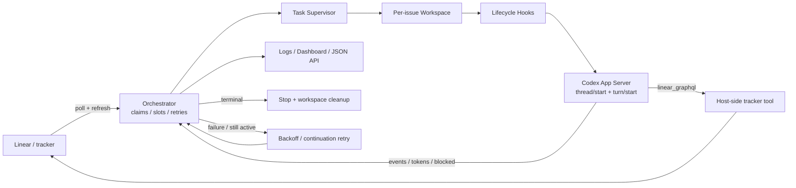

# OpenAI Symphony：能力、架构与适用边界

> 研究截止：2026-07-19（UTC+8）  
> 分析对象：`openai/symphony` 的 `main` 提交 [`7af5a7648c9fbffa08825fe0c0b18be00100aff3`](https://github.com/openai/symphony/commit/7af5a7648c9fbffa08825fe0c0b18be00100aff3)  
> 当前正式发布：[`v0.0.1`](https://github.com/openai/symphony/releases/tag/v0.0.1)，标签提交为 [`91a624958c1cedf2c48840f211d9d017f8a7942e`](https://github.com/openai/symphony/commit/91a624958c1cedf2c48840f211d9d017f8a7942e)  
> 证据范围：官方仓库、固定提交源码、官方 GitHub API/Actions/Release、OpenAI 官方 Codex 文档；未使用第三方解读。  
> 验证说明：本文做源码与官方运行记录分析；未使用真实 Linear/Codex 凭据重跑外部 E2E。

## 结论先行

Symphony 不是新的代码模型，也不是 Codex CLI 的替代品。它是一个长期运行的“工作调度与执行外壳”：持续从 issue tracker 读取任务，为每个 issue 建立隔离工作区，启动 Codex App Server 会话，按 issue 状态管理并发、续跑、失败重试、终止清理和观测。它把工程师的操作单位从“一次 Codex 对话”提升为“看板上的工作项”。官方对其定义与问题陈述见 [README L3-L11](https://github.com/openai/symphony/blob/7af5a7648c9fbffa08825fe0c0b18be00100aff3/README.md#L3-L11) 与 [SPEC L16-L44](https://github.com/openai/symphony/blob/7af5a7648c9fbffa08825fe0c0b18be00100aff3/SPEC.md#L16-L44)。

当前实现的核心判断：

- 适合：有成熟 agent harness、任务可由 Linear 状态机表达、允许自治执行、能够提供隔离环境和最小权限凭据的内部工程团队。
- 核心价值：持续调度、多 issue 并行、每 issue 隔离、多轮续跑、失败重试、状态对账、终态清理、日志/仪表盘，而不是提升单次 Codex 推理能力。
- 当前边界：`main` 的生产 tracker adapter 仍只有 Linear；GitHub Issues、Jira、Asana、GitLab 尚不是已发布能力。[Tracker adapter 表 L13-L23](https://github.com/openai/symphony/blob/7af5a7648c9fbffa08825fe0c0b18be00100aff3/elixir/lib/symphony_elixir/tracker.ex#L13-L23)
- 成熟度：官方明确称其为 trusted environments 中的 engineering preview，Elixir 实现又明确标为 evaluation-only prototype，并建议自行实现加固版本。[README L10-L11](https://github.com/openai/symphony/blob/7af5a7648c9fbffa08825fe0c0b18be00100aff3/README.md#L10-L11)；[Elixir README L3-L8](https://github.com/openai/symphony/blob/7af5a7648c9fbffa08825fe0c0b18be00100aff3/elixir/README.md#L3-L8)
- 成本边界：`agent.max_turns` 只限制单次 worker 生命周期；issue 仍 active 时，正常结束会由 orchestrator 以 1 秒 continuation retry 再调度。因此当前没有“每 issue 的全局 turn/token/费用硬上限”，token 只是观测指标。[Elixir README L162-L165](https://github.com/openai/symphony/blob/7af5a7648c9fbffa08825fe0c0b18be00100aff3/elixir/README.md#L162-L165)；[AgentRunner L88-L131](https://github.com/openai/symphony/blob/7af5a7648c9fbffa08825fe0c0b18be00100aff3/elixir/lib/symphony_elixir/agent_runner.ex#L88-L131)；[SPEC L790-L817](https://github.com/openai/symphony/blob/7af5a7648c9fbffa08825fe0c0b18be00100aff3/SPEC.md#L790-L817)

## A. 可核验事实

### 1. 它解决什么问题

官方规范列出四个目标：把人工脚本变为可重复 daemon；把每个 agent 限定在独立 issue 工作区；将运行配置与 prompt 放进版本化的 `WORKFLOW.md`；为多个并发 agent 提供可运营的观测面。[SPEC L18-L34](https://github.com/openai/symphony/blob/7af5a7648c9fbffa08825fe0c0b18be00100aff3/SPEC.md#L18-L34)

重要责任边界：Symphony 本体是 scheduler/runner 和 tracker reader；状态变更、评论、PR 链接等写操作通常由 Codex 通过 provider-native 工具完成。一次成功运行也可停在 `Human Review` 等工作流交接状态，不必等同于 `Done`。[SPEC L36-L44](https://github.com/openai/symphony/blob/7af5a7648c9fbffa08825fe0c0b18be00100aff3/SPEC.md#L36-L44)

README 演示中的 CI 状态、PR review、复杂度分析、视频 walkthrough 和安全合并，是“Symphony + 项目 prompt/skills/tooling”可实现的工作流结果，不是 orchestrator 内置的 PR 产品功能。规范明确把 ticket/PR/comment 的业务逻辑排除在内核之外。[README L6-L8](https://github.com/openai/symphony/blob/7af5a7648c9fbffa08825fe0c0b18be00100aff3/README.md#L6-L8)；[SPEC L60-L69](https://github.com/openai/symphony/blob/7af5a7648c9fbffa08825fe0c0b18be00100aff3/SPEC.md#L60-L69)

### 2. 当前可以做什么

| 能力 | 当前实现 | 边界/证据 |
|---|---|---|
| 持续取活 | 周期性读取 tracker active states，先对账运行中/阻塞项，再按容量派发 | [Orchestrator L55-L125](https://github.com/openai/symphony/blob/7af5a7648c9fbffa08825fe0c0b18be00100aff3/elixir/lib/symphony_elixir/orchestrator.ex#L55-L125)、[L256-L307](https://github.com/openai/symphony/blob/7af5a7648c9fbffa08825fe0c0b18be00100aff3/elixir/lib/symphony_elixir/orchestrator.ex#L256-L307) |
| 候选筛选 | 校验字段、active/terminal state、adapter 的 `dispatchable`、required labels、claim、并发槽位；按优先级、创建时间、identifier 排序 | [SPEC L735-L789](https://github.com/openai/symphony/blob/7af5a7648c9fbffa08825fe0c0b18be00100aff3/SPEC.md#L735-L789)、[Orchestrator L797-L840](https://github.com/openai/symphony/blob/7af5a7648c9fbffa08825fe0c0b18be00100aff3/elixir/lib/symphony_elixir/orchestrator.ex#L797-L840) |
| 并发控制 | 支持全局上限、按 issue state 上限、SSH host 上限；SSH host 按最低当前负载选择 | [Config schema L143-L169](https://github.com/openai/symphony/blob/7af5a7648c9fbffa08825fe0c0b18be00100aff3/elixir/lib/symphony_elixir/config/schema.ex#L143-L169)、[Orchestrator L1244-L1338](https://github.com/openai/symphony/blob/7af5a7648c9fbffa08825fe0c0b18be00100aff3/elixir/lib/symphony_elixir/orchestrator.ex#L1244-L1338) |
| 每 issue 隔离 | 创建/复用确定性目录；identifier 清洗，必要时附哈希；本地路径做 canonicalize、root containment 和 symlink escape 检查 | [Workspace L15-L45](https://github.com/openai/symphony/blob/7af5a7648c9fbffa08825fe0c0b18be00100aff3/elixir/lib/symphony_elixir/workspace.ex#L15-L45)、[L215-L253](https://github.com/openai/symphony/blob/7af5a7648c9fbffa08825fe0c0b18be00100aff3/elixir/lib/symphony_elixir/workspace.ex#L215-L253)、[L403-L428](https://github.com/openai/symphony/blob/7af5a7648c9fbffa08825fe0c0b18be00100aff3/elixir/lib/symphony_elixir/workspace.ex#L403-L428) |
| 工作区生命周期 | 支持 `after_create`、`before_run`、`after_run`、`before_remove` shell hooks 和超时/失败语义 | [Workspace L187-L391](https://github.com/openai/symphony/blob/7af5a7648c9fbffa08825fe0c0b18be00100aff3/elixir/lib/symphony_elixir/workspace.ex#L187-L391)、[SPEC L903-L949](https://github.com/openai/symphony/blob/7af5a7648c9fbffa08825fe0c0b18be00100aff3/SPEC.md#L903-L949) |
| Codex 深度集成 | 在 issue workspace 启动 `codex app-server`；通过 `thread/start` 建 thread，再通过 `turn/start` 传 prompt、cwd、title、approval 与 sandbox policy | [AppServer L30-L111](https://github.com/openai/symphony/blob/7af5a7648c9fbffa08825fe0c0b18be00100aff3/elixir/lib/symphony_elixir/codex/app_server.ex#L30-L111)、[L309-L367](https://github.com/openai/symphony/blob/7af5a7648c9fbffa08825fe0c0b18be00100aff3/elixir/lib/symphony_elixir/codex/app_server.ex#L309-L367) |
| 多轮续跑 | 同一 worker 内复用同一 app-server thread；每轮结束后刷新 issue，仍 active/routable 就继续，达到 `max_turns` 后交回 orchestrator | [AgentRunner L88-L161](https://github.com/openai/symphony/blob/7af5a7648c9fbffa08825fe0c0b18be00100aff3/elixir/lib/symphony_elixir/agent_runner.ex#L88-L161) |
| 失败恢复 | 正常续跑固定等待 1 秒；失败按 `10s × 2^(attempt-1)` 指数退避，并受 `max_retry_backoff_ms` 限制；retry 前重新读取 issue | [Orchestrator L1022-L1123](https://github.com/openai/symphony/blob/7af5a7648c9fbffa08825fe0c0b18be00100aff3/elixir/lib/symphony_elixir/orchestrator.ex#L1022-L1123)、[L1195-L1206](https://github.com/openai/symphony/blob/7af5a7648c9fbffa08825fe0c0b18be00100aff3/elixir/lib/symphony_elixir/orchestrator.ex#L1195-L1206) |
| 状态对账与清理 | issue 进入 terminal state 后停止 agent 并清理 workspace；不再 active 时停止/释放；派发前再次刷新，降低 stale dispatch | [Elixir README L28-L34](https://github.com/openai/symphony/blob/7af5a7648c9fbffa08825fe0c0b18be00100aff3/elixir/README.md#L28-L34)、[Orchestrator L908-L925](https://github.com/openai/symphony/blob/7af5a7648c9fbffa08825fe0c0b18be00100aff3/elixir/lib/symphony_elixir/orchestrator.ex#L908-L925) |
| Linear 原生工具 | 向 Codex 暴露 `linear_graphql`，由 Symphony host 使用绑定凭据执行；从 Codex 子进程环境移除 tracker secrets | [Elixir README L23-L26](https://github.com/openai/symphony/blob/7af5a7648c9fbffa08825fe0c0b18be00100aff3/elixir/README.md#L23-L26)、[AppServer L194-L253](https://github.com/openai/symphony/blob/7af5a7648c9fbffa08825fe0c0b18be00100aff3/elixir/lib/symphony_elixir/codex/app_server.ex#L194-L253) |
| 热更新配置 | 监测 `WORKFLOW.md`；reload 失败时保留 last-known-good 配置并记录错误 | [WorkflowStore L1-L3](https://github.com/openai/symphony/blob/7af5a7648c9fbffa08825fe0c0b18be00100aff3/elixir/lib/symphony_elixir/workflow_store.ex#L1-L3)、[L122-L179](https://github.com/openai/symphony/blob/7af5a7648c9fbffa08825fe0c0b18be00100aff3/elixir/lib/symphony_elixir/workflow_store.ex#L122-L179) |
| 观测 | 结构化日志、Phoenix LiveView dashboard、只读状态 API、issue 详情、手动 refresh；跟踪 run/retry、token、runtime、rate limit、blocked | [Router L17-L40](https://github.com/openai/symphony/blob/7af5a7648c9fbffa08825fe0c0b18be00100aff3/elixir/lib/symphony_elixir_web/router.ex#L17-L40)、[SPEC L1357-L1631](https://github.com/openai/symphony/blob/7af5a7648c9fbffa08825fe0c0b18be00100aff3/SPEC.md#L1357-L1631) |
| 远程执行 | 可由一个中央 orchestrator 通过 SSH stdio 把 worker 分配到多个远端 host；workspace 位于远端 | [Orchestrator L1244-L1303](https://github.com/openai/symphony/blob/7af5a7648c9fbffa08825fe0c0b18be00100aff3/elixir/lib/symphony_elixir/orchestrator.ex#L1244-L1303)、[AppServer L218-L240](https://github.com/openai/symphony/blob/7af5a7648c9fbffa08825fe0c0b18be00100aff3/elixir/lib/symphony_elixir/codex/app_server.ex#L218-L240)、[SPEC L2250-L2289](https://github.com/openai/symphony/blob/7af5a7648c9fbffa08825fe0c0b18be00100aff3/SPEC.md#L2250-L2289) |

### 3. 当前不能做什么

以下是官方明确的 non-goals 或当前源码边界：

- 不是 rich web UI、multi-tenant control plane、通用 workflow engine 或 distributed job scheduler。[SPEC L60-L69](https://github.com/openai/symphony/blob/7af5a7648c9fbffa08825fe0c0b18be00100aff3/SPEC.md#L60-L69)
- 不内置 ticket、PR、comment 的项目业务逻辑；它们属于 `WORKFLOW.md` prompt、skills 与 agent tools。[SPEC L36-L44](https://github.com/openai/symphony/blob/7af5a7648c9fbffa08825fe0c0b18be00100aff3/SPEC.md#L36-L44)
- 不保证强 sandbox；规范把强度交给 Codex policy、host OS 和外部容器/VM。[SPEC L1719-L1730](https://github.com/openai/symphony/blob/7af5a7648c9fbffa08825fe0c0b18be00100aff3/SPEC.md#L1719-L1730)
- 当前生产 adapter registry 只注册了 `linear`；`Tracker.Memory` 虽作为测试/本地模块存在，但没有进入 registry。GitHub Issues/Jira/Asana/GitLab 均不是当前生产能力。[Tracker L13-L23](https://github.com/openai/symphony/blob/7af5a7648c9fbffa08825fe0c0b18be00100aff3/elixir/lib/symphony_elixir/tracker.ex#L13-L23)；[Tracker.Memory L1-L52](https://github.com/openai/symphony/blob/7af5a7648c9fbffa08825fe0c0b18be00100aff3/elixir/lib/symphony_elixir/tracker/memory.ex#L1-L52)
- 不恢复精确的 in-memory scheduler state；重启后依赖 tracker 与 filesystem 对账，blocked map 也会清空。[SPEC L48-L58](https://github.com/openai/symphony/blob/7af5a7648c9fbffa08825fe0c0b18be00100aff3/SPEC.md#L48-L58)；[Elixir README L31-L34](https://github.com/openai/symphony/blob/7af5a7648c9fbffa08825fe0c0b18be00100aff3/elixir/README.md#L31-L34)
- 没有跨实例 lease、原子 claim 或持久队列；`claimed` 只是单个 Orchestrator 进程里的 `MapSet`，tracker 接口也没有 claim 写入协议。因而两个实例指向同一 scope 时可能重复处理同一 issue，当前不能承诺 HA 或 at-most-once。[Orchestrator State L24-L44](https://github.com/openai/symphony/blob/7af5a7648c9fbffa08825fe0c0b18be00100aff3/elixir/lib/symphony_elixir/orchestrator.ex#L24-L44)；[Tracker boundary L3-L69](https://github.com/openai/symphony/blob/7af5a7648c9fbffa08825fe0c0b18be00100aff3/elixir/lib/symphony_elixir/tracker.ex#L3-L69)
- 当前没有每 issue 的全局 retries/turns/token/cost quota。配置只有单 worker 的 `max_turns` 与 retry delay cap；正常 worker 退出后，只要 issue 仍 active，Orchestrator 会以 1 秒 continuation retry 继续调度。[Config schema L143-L169](https://github.com/openai/symphony/blob/7af5a7648c9fbffa08825fe0c0b18be00100aff3/elixir/lib/symphony_elixir/config/schema.ex#L143-L169)；[AgentRunner L88-L131](https://github.com/openai/symphony/blob/7af5a7648c9fbffa08825fe0c0b18be00100aff3/elixir/lib/symphony_elixir/agent_runner.ex#L88-L131)；[Orchestrator L208-L222](https://github.com/openai/symphony/blob/7af5a7648c9fbffa08825fe0c0b18be00100aff3/elixir/lib/symphony_elixir/orchestrator.ex#L208-L222)；[L1195-L1205](https://github.com/openai/symphony/blob/7af5a7648c9fbffa08825fe0c0b18be00100aff3/elixir/lib/symphony_elixir/orchestrator.ex#L1195-L1205)
- 仓库 checkout 不是 Orchestrator 内建能力，而是 `after_create` hook 的责任。该 hook 只在目录首次创建时运行；若它失败并留下空目录或半成品目录，后续 retry 会复用目录而不会自动重跑初始化 hook，部署方需要让 hook 幂等或主动清理失败现场。[Workspace L15-L45](https://github.com/openai/symphony/blob/7af5a7648c9fbffa08825fe0c0b18be00100aff3/elixir/lib/symphony_elixir/workspace.ex#L15-L45)；[L255-L270](https://github.com/openai/symphony/blob/7af5a7648c9fbffa08825fe0c0b18be00100aff3/elixir/lib/symphony_elixir/workspace.ex#L255-L270)

### 4. 核心架构与执行流

规范把系统分为 workflow loader、typed config、tracker adapter、orchestrator、workspace manager、agent runner、status surface 与 logging；并进一步区分 policy、configuration、coordination、execution、integration、observability 六层。[SPEC L71-L141](https://github.com/openai/symphony/blob/7af5a7648c9fbffa08825fe0c0b18be00100aff3/SPEC.md#L71-L141)

| 模块 | 责任 |
|---|---|
| `Workflow` / `WorkflowStore` | 解析 YAML front matter + Markdown prompt；缓存和热更新 last-known-good workflow |
| `Config.Schema` | 用 Ecto embedded schema 做 typed defaults、校验、env/path 解析 |
| `Tracker` / `Linear.Adapter` | tracker 读模型与 provider tool 边界；scheduler 不依赖 Linear 写语义 |
| `Orchestrator` | 唯一调度权威，维护 running/claimed/blocked/retry/token/rate-limit 内存状态 |
| `AgentRuntimeSupervisor` | 以 OTP supervision tree 绑定 Task Supervisor 与 Orchestrator 生命周期；使用 `one_for_all` | 
| `Workspace` / `PathSafety` | issue 到目录的稳定映射、hook、清理与本地路径防逃逸 |
| `AgentRunner` | 创建 workspace、运行 hooks、启动会话、多轮 turn、每轮刷新 issue |
| `Codex.AppServer` / `DynamicTool` | 实现 app-server JSONL 协议、approval/input/tool 处理和 Linear tool 绑定 |
| `HttpServer` / Phoenix LiveView | 可选 dashboard 与 `/api/v1/*` 运维 API |
| `SSH` | 远端 worker 的 shell/stdio transport |

实际 OTP child tree 包含 PubSub、WorkflowStore、AgentRuntimeSupervisor、HttpServer 和 StatusDashboard；AgentRuntimeSupervisor 再以 `one_for_all` 监督 task supervisor 与 orchestrator。[Application L34-L50](https://github.com/openai/symphony/blob/7af5a7648c9fbffa08825fe0c0b18be00100aff3/elixir/lib/symphony_elixir.ex#L34-L50)；[AgentRuntimeSupervisor L15-L33](https://github.com/openai/symphony/blob/7af5a7648c9fbffa08825fe0c0b18be00100aff3/elixir/lib/symphony_elixir/agent_runtime_supervisor.ex#L15-L33)

一次正常 issue 流程是：poll/reconcile → 选候选 → 派发前再次刷新 → spawn task 并 claim → 创建/复用 workspace → hooks → App Server thread/turn → 每轮刷新 issue → 继续、结束或交回调度器 → terminal cleanup / failure retry。对应参考算法见 [SPEC L1797-L2046](https://github.com/openai/symphony/blob/7af5a7648c9fbffa08825fe0c0b18be00100aff3/SPEC.md#L1797-L2046)，实际 task 派发状态见 [Orchestrator L908-L990](https://github.com/openai/symphony/blob/7af5a7648c9fbffa08825fe0c0b18be00100aff3/elixir/lib/symphony_elixir/orchestrator.ex#L908-L990)。

### 5. 配置与运行

#### 5.1 两种采用方式

仓库刻意同时提供“规范”和“参考实现”：可以让 coding agent 按 `SPEC.md` 用任意语言实现，也可以使用实验性的 Elixir/OTP 版本。[README L21-L35](https://github.com/openai/symphony/blob/7af5a7648c9fbffa08825fe0c0b18be00100aff3/README.md#L21-L35)

源码构建路径是：安装 `mise` 管理的 Elixir/Erlang，执行 `mix setup`、`mix build`，然后运行 `./bin/symphony ./WORKFLOW.md`。[Elixir README L54-L73](https://github.com/openai/symphony/blob/7af5a7648c9fbffa08825fe0c0b18be00100aff3/elixir/README.md#L54-L73)

自包含 Burrito 二进制内嵌 Erlang/OTP、Elixir 和 Symphony，但目标机器仍必须安装 `codex`、`git` 并提供 tracker credentials；官方发布 macOS/Linux 的 arm64/x86_64 四种目标。[Elixir README L75-L96](https://github.com/openai/symphony/blob/7af5a7648c9fbffa08825fe0c0b18be00100aff3/elixir/README.md#L75-L96)

#### 5.2 `WORKFLOW.md` 契约

`WORKFLOW.md` 前半部是 YAML 配置，后半部是传给 Codex 的 Markdown/Liquid prompt。最小配置和 CLI flags 见 [Elixir README L98-L139](https://github.com/openai/symphony/blob/7af5a7648c9fbffa08825fe0c0b18be00100aff3/elixir/README.md#L98-L139)。

| 区域 | 主要字段 | schema 默认值/说明 |
|---|---|---|
| `tracker` | `kind`、`provider`、`required_labels`、`active_states`、`terminal_states` | 当前生产 profile 为 Linear；`project_slug` 必填，token 默认读取 `LINEAR_API_KEY`。[Elixir README L199-L218](https://github.com/openai/symphony/blob/7af5a7648c9fbffa08825fe0c0b18be00100aff3/elixir/README.md#L199-L218) |
| `polling` | `interval_ms` | 默认 30,000 ms。[Schema L89-L103](https://github.com/openai/symphony/blob/7af5a7648c9fbffa08825fe0c0b18be00100aff3/elixir/lib/symphony_elixir/config/schema.ex#L89-L103) |
| `workspace` | `root` | 默认系统临时目录下 `symphony_workspaces`。[Schema L107-L119](https://github.com/openai/symphony/blob/7af5a7648c9fbffa08825fe0c0b18be00100aff3/elixir/lib/symphony_elixir/config/schema.ex#L107-L119) |
| `worker` | `ssh_hosts`、`max_concurrent_agents_per_host` | 默认本地执行；SSH host list 默认为空。[Schema L124-L139](https://github.com/openai/symphony/blob/7af5a7648c9fbffa08825fe0c0b18be00100aff3/elixir/lib/symphony_elixir/config/schema.ex#L124-L139) |
| `agent` | 全局/按 state 并发、`max_turns`、`max_retry_backoff_ms` | 默认 10 agents、单 worker 20 turns、退避上限 300,000 ms。[Schema L143-L169](https://github.com/openai/symphony/blob/7af5a7648c9fbffa08825fe0c0b18be00100aff3/elixir/lib/symphony_elixir/config/schema.ex#L143-L169) |
| `codex` | command、approval、thread/turn sandbox、turn/read/stall timeout | 默认 `codex app-server`、`workspace-write`；turn 1h、read 5s、stall 5m。[Schema L174-L225](https://github.com/openai/symphony/blob/7af5a7648c9fbffa08825fe0c0b18be00100aff3/elixir/lib/symphony_elixir/config/schema.ex#L174-L225) |
| `hooks` | 四个 lifecycle scripts、`timeout_ms` | 默认超时 60s。[Schema L230-L248](https://github.com/openai/symphony/blob/7af5a7648c9fbffa08825fe0c0b18be00100aff3/elixir/lib/symphony_elixir/config/schema.ex#L230-L248) |
| `observability` | dashboard、refresh/render interval | dashboard 开关默认 true；HTTP server 仍需 port 才启动。[Schema L252-L270](https://github.com/openai/symphony/blob/7af5a7648c9fbffa08825fe0c0b18be00100aff3/elixir/lib/symphony_elixir/config/schema.ex#L252-L270) |
| `server` | `port`、`host` | 未配 port 时禁用；host 默认 `127.0.0.1`。[Schema L273-L287](https://github.com/openai/symphony/blob/7af5a7648c9fbffa08825fe0c0b18be00100aff3/elixir/lib/symphony_elixir/config/schema.ex#L273-L287) |

不要混淆“schema 默认值”和“仓库自用示例”。schema 在未配置时采用拒绝 approval request 的对象策略，而仓库的 `elixir/WORKFLOW.md` 明确设置 `approval_policy: never`、`workspace-write` 和 `networkAccess: true`，并每 5 秒轮询。这是 trusted-environment 示例，不是保守生产基线。[Schema L181-L197](https://github.com/openai/symphony/blob/7af5a7648c9fbffa08825fe0c0b18be00100aff3/elixir/lib/symphony_elixir/config/schema.ex#L181-L197)；[WORKFLOW L18-L39](https://github.com/openai/symphony/blob/7af5a7648c9fbffa08825fe0c0b18be00100aff3/elixir/WORKFLOW.md#L18-L39)

### 6. 技术栈与交付形态

- Runtime：Elixir `1.19.5` / Erlang OTP 28。[mise.toml](https://github.com/openai/symphony/blob/7af5a7648c9fbffa08825fe0c0b18be00100aff3/elixir/mise.toml#L1-L3)
- 并发/容错：BEAM/OTP Supervisor、GenServer、Task.Supervisor；项目选择 Elixir 的官方理由是长期进程监督与热更新。[Elixir README L294-L300](https://github.com/openai/symphony/blob/7af5a7648c9fbffa08825fe0c0b18be00100aff3/elixir/README.md#L294-L300)
- Web：Phoenix 1.8、LiveView 1.1、Bandit；数据/配置依赖 Req、Jason、YamlElixir、Solid、Ecto。[mix.exs L66-L82](https://github.com/openai/symphony/blob/7af5a7648c9fbffa08825fe0c0b18be00100aff3/elixir/mix.exs#L66-L82)
- 发布：Burrito 自包含 executable；GitHub Actions 构建并 smoke-test 四个平台目标并附 SHA-256。[release workflow L13-L123](https://github.com/openai/symphony/blob/7af5a7648c9fbffa08825fe0c0b18be00100aff3/.github/workflows/burrito-release.yml#L13-L123)
- License：Apache-2.0。[README L39-L41](https://github.com/openai/symphony/blob/7af5a7648c9fbffa08825fe0c0b18be00100aff3/README.md#L39-L41)

### 7. 成熟度、测试与发布状态

1. **版本阶段**：项目版本是 `0.0.1`，根 README 将其标为 trusted-environment engineering preview，Elixir README 将参考实现标为 evaluation-only prototype。[mix.exs L4-L10](https://github.com/openai/symphony/blob/7af5a7648c9fbffa08825fe0c0b18be00100aff3/elixir/mix.exs#L4-L10)；[README L8-L12](https://github.com/openai/symphony/blob/7af5a7648c9fbffa08825fe0c0b18be00100aff3/README.md#L8-L12)；[Elixir README L3-L8](https://github.com/openai/symphony/blob/7af5a7648c9fbffa08825fe0c0b18be00100aff3/elixir/README.md#L3-L8)
2. **发布与 main 有差异**：本报告分析的 `main` 比 `v0.0.1` 多 2 个提交；generic tracker interface 是 release 后的 `#102`。因此下载的 `v0.0.1` 二进制不能自动视为包含本文所有 `main` 接口变化。[官方 compare](https://github.com/openai/symphony/compare/v0.0.1...7af5a7648c9fbffa08825fe0c0b18be00100aff3)
3. **CI gate**：`make all` 包含 setup/build、format check、strict lint/spec check、coverage、Dialyzer；HEAD 的公开 `make-all` check 成功。[Makefile L20-L47](https://github.com/openai/symphony/blob/7af5a7648c9fbffa08825fe0c0b18be00100aff3/elixir/Makefile#L20-L47)；[GitHub Actions job](https://github.com/openai/symphony/actions/runs/29631549474/job/88046020000)
4. **真实 E2E 是显式 opt-in**：`make e2e` 会创建临时 Linear 项目/issue、启动真实 Codex，会测试本地与 SSH worker；普通 CI 不自动具备这些外部凭据。[Elixir README L258-L292](https://github.com/openai/symphony/blob/7af5a7648c9fbffa08825fe0c0b18be00100aff3/elixir/README.md#L258-L292)
5. **coverage 数字需谨慎解释**：配置虽设 100% threshold，但同时排除了 Orchestrator、AgentRunner、AppServer、Workspace、Web 等大量核心 runtime modules；不能把该阈值理解为“核心系统每行均覆盖”。[mix.exs L11-L41](https://github.com/openai/symphony/blob/7af5a7648c9fbffa08825fe0c0b18be00100aff3/elixir/mix.exs#L11-L41)
6. **底层接口仍在演进**：当前 Codex 官方 CLI reference 将 `codex app-server` 标为 experimental；官方 App Server 文档把它定位为 rich-client 深度集成协议，而一般 CI automation 更推荐 Codex SDK。[CLI reference](https://learn.chatgpt.com/docs/developer-commands?surface=cli#cli-codex-app-server)；[App Server docs](https://learn.chatgpt.com/docs/app-server)

### 8. 安全与运维事实

- 本地 workspace 防线包括 sanitized directory、canonical path、root containment 和 symlink escape 检查；规范仍强调这不能替代 approval/sandbox。[Workspace L403-L428](https://github.com/openai/symphony/blob/7af5a7648c9fbffa08825fe0c0b18be00100aff3/elixir/lib/symphony_elixir/workspace.ex#L403-L428)；[SPEC L1719-L1744](https://github.com/openai/symphony/blob/7af5a7648c9fbffa08825fe0c0b18be00100aff3/SPEC.md#L1719-L1744)
- tracker secret 支持 `$VAR`，不应写入 repo-owned workflow；adapter 声明的 secret env 会从本地/远程 Codex 子进程移除。[AppServer L223-L252](https://github.com/openai/symphony/blob/7af5a7648c9fbffa08825fe0c0b18be00100aff3/elixir/lib/symphony_elixir/codex/app_server.ex#L223-L252)；[SPEC L1746-L1756](https://github.com/openai/symphony/blob/7af5a7648c9fbffa08825fe0c0b18be00100aff3/SPEC.md#L1746-L1756)
- 仓库示例 Codex 命令要求继承全部 shell 环境；实现只保证移除 adapter 明确声明的 tracker secret 名称，其他云凭据、SSH agent、包仓库 token 等仍需部署方单独收敛。[WORKFLOW L30-L39](https://github.com/openai/symphony/blob/7af5a7648c9fbffa08825fe0c0b18be00100aff3/elixir/WORKFLOW.md#L30-L39)；[AppServer L223-L258](https://github.com/openai/symphony/blob/7af5a7648c9fbffa08825fe0c0b18be00100aff3/elixir/lib/symphony_elixir/codex/app_server.ex#L223-L258)
- `linear_graphql` 由 host 持 token 执行，但其权限覆盖 token 能访问的范围；它没有 idempotency key、retry、project scope guard 或 rate-limit policy。[Elixir README L219-L238](https://github.com/openai/symphony/blob/7af5a7648c9fbffa08825fe0c0b18be00100aff3/elixir/README.md#L219-L238)
- hooks 是来自 `WORKFLOW.md` 的任意 shell 脚本，被视为完全可信配置；必须用 timeout 避免挂死。[SPEC L1758-L1767](https://github.com/openai/symphony/blob/7af5a7648c9fbffa08825fe0c0b18be00100aff3/SPEC.md#L1758-L1767)
- dashboard/API 默认只绑定 loopback；Router 未配置身份认证/授权 pipeline，API 还包含 `POST /api/v1/refresh`。若将 host 改为非 loopback，应在外层加认证与网络隔离。[Config schema L273-L287](https://github.com/openai/symphony/blob/7af5a7648c9fbffa08825fe0c0b18be00100aff3/elixir/lib/symphony_elixir/config/schema.ex#L273-L287)；[HttpServer L19-L48](https://github.com/openai/symphony/blob/7af5a7648c9fbffa08825fe0c0b18be00100aff3/elixir/lib/symphony_elixir/http_server.ex#L19-L48)；[Router L25-L40](https://github.com/openai/symphony/blob/7af5a7648c9fbffa08825fe0c0b18be00100aff3/elixir/lib/symphony_elixir_web/router.ex#L25-L40)
- 规范直接警告：外部可控 tracker、repo、prompt 或 tool 参数可造成数据泄露、破坏性变更甚至主机失陷；建议使用专用 OS user、容器/VM、网络限制、最小凭据和 task allowlist。[SPEC L1769-L1795](https://github.com/openai/symphony/blob/7af5a7648c9fbffa08825fe0c0b18be00100aff3/SPEC.md#L1769-L1795)
- SSH 模式引入远端环境漂移、workspace locality、路径/quoting、host 健康、冷重启和跨 host 重复副作用等额外问题；规范把它们列为部署方需要解决的事项。[SPEC L2291-L2310](https://github.com/openai/symphony/blob/7af5a7648c9fbffa08825fe0c0b18be00100aff3/SPEC.md#L2291-L2310)
- 本地 workspace 会做 canonical root containment 与 symlink escape 检查；远端 workspace 校验只拒绝空值和控制字符，不能提供同等级的真实路径边界保证。SSH worker 应视为完整信任边界，而不是本地 sandbox 的透明扩展。[Workspace L403-L442](https://github.com/openai/symphony/blob/7af5a7648c9fbffa08825fe0c0b18be00100aff3/elixir/lib/symphony_elixir/workspace.ex#L403-L442)

### 9. 与普通 Codex CLI / 单 agent 脚本的差异

| 维度 | `codex` / `codex exec` | Symphony |
|---|---|---|
| 入口 | 人从 terminal TUI 发起，或脚本调用一次 `codex exec`；官方把后者定位于 CI、pipeline、可 pipe 输出的非交互运行。[官方 non-interactive docs](https://learn.chatgpt.com/docs/non-interactive-mode) | daemon 持续从 tracker 拉取，不需要人为逐项启动 |
| 控制面 | prompt、cwd、CLI flags/config | issue state、labels、priority、claim、global/state/host slots、retry queue、workflow config |
| 执行隔离 | 用户/脚本选择一个 cwd/sandbox | 自动为每个 issue 建独立且可复用 workspace，并管理 hooks/清理 |
| 会话 | 一次交互或一次 exec；可自行 resume | 每个 worker 启动 App Server thread，连续运行 turns；跨 worker 由 issue/workspace 重新调度 |
| 故障处理 | 由人或外围脚本决定 | 内置 retry/backoff、stall、状态 refresh、terminal reconciliation |
| 多任务并发 | 需用户或脚本自行编排多个进程 | 内建全局、state、SSH host 三层容量管理 |
| tracker 写操作 | CLI 可通过用户配置的 MCP/工具完成 | scheduler 只读；provider-native dynamic tool 在 host 侧执行写操作并集中管理凭据 |
| 观测 | 终端/JSONL/rollout 文件 | 汇总所有 issue 的 logs、dashboard、REST snapshot、tokens、runtime、rate limits、blocked |
| 状态持久性 | 由 Codex session/调用方决定 | scheduler 状态主要在内存；恢复依赖 tracker + workspace，而非 durable job DB |

简言之：`codex exec` 是“一次自动化调用”的构件；Symphony 是“持续把一批工作项映射为许多 Codex 生命周期”的控制器。它补的是编排与运维，不是模型能力。

## B. 分析与建议

### 10. 适用场景

以下判断建立在前述事实之上：

1. **内部 feature/bug 队列自治执行**：任务边界清楚、验收命令稳定、仓库 harness 完善，issue 可从 Todo → In Progress → Review/Done 驱动。
2. **并行消化相互独立的 tickets**：每 issue workspace + 多级并发限制可减少 checkout 冲突；但共享外部服务仍需项目自己隔离。
3. **需要长任务续跑的 agent 平台实验**：同 thread 多 turn、worker 间 continuation retry、workspace 保留，适合研究“让 agent 持续做到 tracker 状态变化”。
4. **集中调度、多机器执行**：单 orchestrator + SSH host pool 可扩充算力，但不是 HA/distributed scheduler。
5. **把团队工程规范固化为 repo contract**：`WORKFLOW.md` 同时版本化运行参数和 prompt，skills 承载 ticket/PR/CI 的业务策略。

不建议直接用于：公开或不可信 issue 自动取活、缺少测试/验收 harness 的仓库、强合规多租户 SaaS、要求 exactly-once/持久队列/审计不可丢失的任务、必须预先锁死每 ticket 费用的场景。

### 11. 值得借鉴的设计

1. **Spec-first，可移植而非绑定实现**：仓库把语言无关的 service contract 放在 `SPEC.md`，Elixir 只是实验参考实现。[README L21-L35](https://github.com/openai/symphony/blob/7af5a7648c9fbffa08825fe0c0b18be00100aff3/README.md#L21-L35)
2. **配置和 prompt 合一的 repo-owned contract**：部署参数、sandbox、hooks 与工作指令在同一 `WORKFLOW.md` 评审和版本化；代价是该文件本身必须进入高信任配置边界。[SPEC L318-L532](https://github.com/openai/symphony/blob/7af5a7648c9fbffa08825fe0c0b18be00100aff3/SPEC.md#L318-L532)
3. **“scheduler 读、agent tool 写”的 provider 边界**：orchestrator 不包含 Linear mutation 业务逻辑，adapter 绑定 session 期内的 tool specs、settings 和 secret names，避免 hot reload 导致 auth/tool 漂移。[Tracker L39-L69](https://github.com/openai/symphony/blob/7af5a7648c9fbffa08825fe0c0b18be00100aff3/elixir/lib/symphony_elixir/tracker.ex#L39-L69)
4. **tracker 是 durable intent，host-local workspace 是进程重启后的 work 对账来源，scheduler 是可重建缓存**：省去数据库和迁移，但牺牲精确 restart state、lease、全局预算与 HA；SSH 模式下 workspace 通常只存在于原 host。
5. **派发前 revalidation**：即使 poll 刚看到候选，也在 spawn 前按 ID 再读一次，降低任务已变更却仍被启动的竞态。[Orchestrator L908-L925](https://github.com/openai/symphony/blob/7af5a7648c9fbffa08825fe0c0b18be00100aff3/elixir/lib/symphony_elixir/orchestrator.ex#L908-L925)
6. **同 thread continuation**：第一轮发送完整 workflow prompt，后续只发送 continuation guidance，复用上下文与 workspace，避免每轮从零开始。[AgentRunner L142-L153](https://github.com/openai/symphony/blob/7af5a7648c9fbffa08825fe0c0b18be00100aff3/elixir/lib/symphony_elixir/agent_runner.ex#L142-L153)
7. **配置 last-known-good**：启动时严格失败，运行中 reload 失败则保留可用配置，兼顾正确性和长服务可用性。[Elixir README L193-L197](https://github.com/openai/symphony/blob/7af5a7648c9fbffa08825fe0c0b18be00100aff3/elixir/README.md#L193-L197)
8. **调度权威与 worker 生命周期耦合**：`one_for_all` 避免 orchestrator 重启后旧 worker 继续产生无人认领的副作用。[AgentRuntimeSupervisor L21-L33](https://github.com/openai/symphony/blob/7af5a7648c9fbffa08825fe0c0b18be00100aff3/elixir/lib/symphony_elixir/agent_runtime_supervisor.ex#L21-L33)

### 12. 建议的最低安全上线线

在正式评估前，建议至少：

- 只接一个专用 Linear project/team，并配置 non-empty `required_labels` 作为 opt-in allowlist；
- 使用独立、最小权限 tracker token；确认 `linear_graphql` 能访问的真实范围；
- 不照抄仓库的 `approval_policy: never`；从 schema 的拒绝/审批默认开始逐项开放；
- 默认关闭网络，只为确需安装依赖的 turn 开放；把 agent 放进专用 OS user + container/VM；
- 保持 dashboard 在 loopback；若外放，前置 TLS、认证、授权与网络策略；
- 为 retries、运行时长、token/费用、外部 mutation 增加独立预算/熔断器；当前内核没有 per-issue 全局硬上限；
- 对 hook、WORKFLOW、skills 走与生产代码相同的 review；对写操作设计幂等性；
- 先跑 disposable project 的 live E2E，再用低并发、低权限、人工观察的 canary board；
- 若使用 SSH，补 host health、workspace ownership、冷重试与跨 host duplicate 防护。

### 13. 待确认问题与路线信号

以下项目不应被写成现有能力：

1. **其他 tracker 何时进入正式版本？** 当前已有 open PR：[#103 GitHub Issues](https://github.com/openai/symphony/pull/103)、[#104 Jira Cloud](https://github.com/openai/symphony/pull/104)、[#105 Asana](https://github.com/openai/symphony/pull/105)、[#106 GitLab](https://github.com/openai/symphony/pull/106)，但研究截止时均未合并。
2. **多 orchestrator 的 claim lease/heartbeat 如何实现？** [#82](https://github.com/openai/symphony/pull/82) 与 [#83](https://github.com/openai/symphony/pull/83) 是相关 open PR；当前规范仍是单一 authoritative orchestrator。
3. **per-issue token/成本持久化何时落地？** [#60](https://github.com/openai/symphony/pull/60) 是相关 open PR；当前 token totals/blocked/retry 主要是内存观测状态。
4. **Codex App Server 兼容矩阵是什么？** Symphony 未把 Codex 二进制嵌入 release；部分 policy 字段由目标 App Server schema 决定。[Elixir README L150-L161](https://github.com/openai/symphony/blob/7af5a7648c9fbffa08825fe0c0b18be00100aff3/elixir/README.md#L150-L161)
5. **生产身份认证、审计留存、HA、持久队列与 exactly-once 是否会成为项目目标？** 当前 SPEC 明确不把 multi-tenant control plane/general distributed scheduler 作为目标，不能预设会提供。
6. **何时发布包含 generic tracker interface 的下一个二进制？** 当前 `main` 已超过 `v0.0.1`，但唯一公开 release 仍是 `v0.0.1`。

## 主要一手资料索引

- [项目 README（固定提交）](https://github.com/openai/symphony/blob/7af5a7648c9fbffa08825fe0c0b18be00100aff3/README.md)
- [语言无关 SPEC（固定提交）](https://github.com/openai/symphony/blob/7af5a7648c9fbffa08825fe0c0b18be00100aff3/SPEC.md)
- [Elixir README（固定提交）](https://github.com/openai/symphony/blob/7af5a7648c9fbffa08825fe0c0b18be00100aff3/elixir/README.md)
- [`WORKFLOW.md` 示例（固定提交）](https://github.com/openai/symphony/blob/7af5a7648c9fbffa08825fe0c0b18be00100aff3/elixir/WORKFLOW.md)
- [Elixir runtime 源码（固定提交）](https://github.com/openai/symphony/tree/7af5a7648c9fbffa08825fe0c0b18be00100aff3/elixir/lib)
- [v0.0.1 release](https://github.com/openai/symphony/releases/tag/v0.0.1)
- [Codex App Server 官方文档](https://learn.chatgpt.com/docs/app-server)
- [Codex 非交互模式官方文档](https://learn.chatgpt.com/docs/non-interactive-mode)
